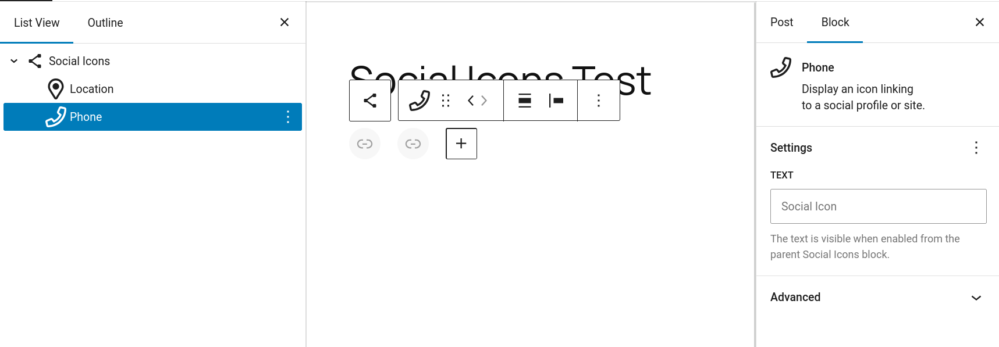
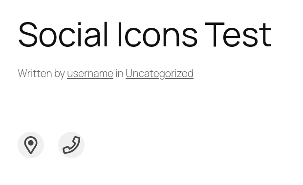

# Social Icon Block Variations

This plugin adds the following icons to the Social Icons block using block variations:

* Location
* Phone

## Screenshots

| Block Editor | Frontend |
| ------------ | -------- |
|  |  |

## Building

This plugin utilizes `gulp` to generate the default `icons.json` file and package necessary assets to be compatible with standard WordPress plugin installation. Use the following commands to build `social-icon-block-variations

``` shell
npm install
gulp
```

## Install

### WordPress Plugin

Using the `social-icon-block-variations.zip` plugin archive file, [follow the steps provided by WordPress](https://wordpress.org/documentation/article/manage-plugins/#upload-via-wordpress-admin) to manually install the plugin to your WordPress site.

### Composer

It is possible to include this repository within a custom WordPress theme using composer.

1. Add repository to composer.json:

``` json
{
    "repositories": {
        "relic-se/social-icon-block-variations": {
            "type": "vcs",
            "url": "git@github.com:relic-se/social-icon-block-variations.git"
        }
    }
}
```

2. Install package with composer: `composer require relic-se/social-icon-block-variations:dev-main`
3. Load all composer packages within `functions.php`: `require_once 'vendor/autoload.php';`

## Known issues

* Icons do not render properly within the block editor content and will display the default link icon.
* Default titles are not currently supported. The icon variations included in this plugin will have a default title of "Social Icon".
